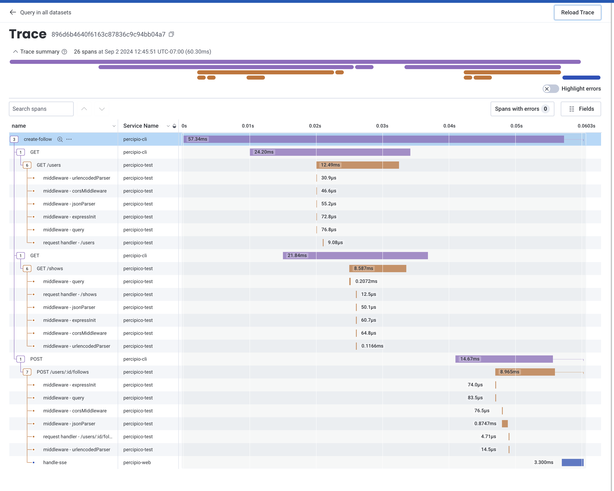
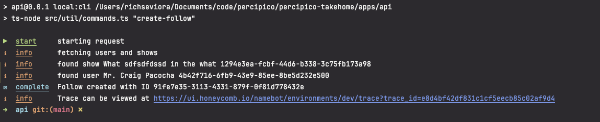

# full-stack-test-template

A monorepo template to use for our full-stack test.


## Configuring

I've added the open-telemetry collector as a docker-file as a separate project. Running `pnpm run start:dev` from root will also launch it. You need Docker installed to run it.

Create a `.env` file in the repository root with the following values:

```bash
OTEL_SERVICE_NAME=percipio-test
OTEL_EXPORTER_OTLP_PROTOCOL=http/protobuf
OTEL_EXPORTER_OTLP_ENDPOINT="https://api.honeycomb.io"
OTEL_EXPORTER_OTLP_HEADERS=x-honeycomb-team=API_KEY_HERE
HC_API_KEY=API_KEY_HERE
HC_TEAM=NAME_OF_HONEYCOMB_TEAM_HERE
HC_ENV=NAME_OF_HONEYCOMB_ENV_HERE
```

## THINGS TO PAY ATTENTION TO

A big focus of my work has been in systems reliability and observablity. So I thought I'd lean into that here:



This is a screenshot of a trace emitted to Honeycomb. 
It includes all the telemetry related to a single request from: 
- [from the CLI I built](apps/api/src/util/commands.ts) to automate data creation (purple bars).
- [the API itself](apps/api/src/tracing.ts) with auto-instrumentation of Express/Nest handlers and HTTP requests (orange/brown bars).
- [the web client](apps/web/src/tracing/tracing.ts) with manual instrumentation of SSE events (blue bar).

The CLI I built can be run from the `api` project with `pnpm run local:cli`. 



- The CLI is built to be unobtrusive and easily scanned by a busy developer - so there's colors and a link to the generated trace on Honeycomb.

Eddie told me not to spend too much time on the project, so I didn't spend a lot of time updating the web interface beyond the following:

- Things look a bit nicer!
- Creating a new user or follow through the CLI will automatically reload the users list and follows in place as appropriate.
- Creating a new follow will add a star to the user (until the toast is dismissed).

## Expectations

As the name implies this is meant to be a full-stack test, but no full-stack engineer
focuses equally on frontend and backend. Please complete both ends of the test, but
feel free to lean more into the area you are most passionate about.

There is no time limit imposed by us or required response time. You can do a little each
day over a weeks time or get it all done in a few hours. It's completely up to you,
your schedule, and what you care to invest in this test. Just know that we don't need
you to go overboard - it's just one part of your overall assessment and we know you have
a life outside of working on this test.

## Process

1. Start by using this template. You can do this by clicking the "Use this template" button in the top right, then "Create a new reposistory". You should make this new repo private.
2. Read the details about the test below and complete the test to your liking.
3. Invite the code review team to your repository and email us to let us know it's ready. If the list of GitHub users has not already been provided to you, work with your contact here to get that list.
4. We will review your work and schedule a technical interview where you will meet some of our engineers and discuss this test.

# The Test

There are two sections to the test: API and UI.
There are READMEs in each workspace, though they are just the default READMEs generated by NestJS & Vite.
You can use them for reference or modify/replace them with anything you want to document.

## API

[Set up a SQLite database with TypeORM](https://docs.nestjs.com/techniques/database) and configure it with the NestJS workspace. Create simple CRUD endpoints for any kind of entity (“users” would be a go-to default but feel free to come up with something more interesting to you, pick something from a hobby or a TV show you like; anything), and also create an [SSE](https://docs.nestjs.com/techniques/server-sent-events) endpoint that sends notifications when an entity is created. Bonus points if your entity has any one-to-one or many-to-one relations. We would expect everything to follow Nest’s and TypeORM’s patterns, shown in their documentation. This includes [controller](https://docs.nestjs.com/controllers)/[provider](https://docs.nestjs.com/providers) separation and [TypeORM repositories & entities](https://docs.nestjs.com/techniques/database#repository-pattern).

Just for the sake of this test, commit & push your SQLite database as well with a number of records already populated in the database.

## UI

Find something that inspires you on [Dribbble](https://dribbble.com/shots/popular/web-design) and use that as a basis for your front end. We’re not expecting anything crazy but we just want to compare what you picked vs what you implemented to see how you implement a design. **The only thing we specifically ask is that you use [MUI](https://mui.com/material-ui/getting-started/) components**, only because that’s what we use for our web apps. Develop a page that loads your API’s entities (e.g. “users”) and displays them as a list along with any of their detailed information.

Also develop a working frontend implementation of your SSE endpoint so that toast notifications are displayed whenever one of your entities is created.

**We want to emphasize that we do not expect a full scale application with working navigation, complex animations, etc. You should only develop what you need in order to accomplish the goal we've given. Dribbble designs should be used as a basis/foundation for your app's design, not as a goal in itself.**

# Prerequisites

- [nvm](https://github.com/nvm-sh/nvm?tab=readme-ov-file#installing-and-updating) or [Node.js v20.12.0](https://nodejs.org/en/download)
- [pnpm](https://pnpm.io/installation#using-corepack) _(We recommend installing with Corepack)_
- (Optional) [nx](https://nx.dev/getting-started/installation) for running workspaces

# Technologies

Just like the stack we use in our monorepo, this monorepo uses [**NestJS**](https://docs.nestjs.com/) for the API, and **React** (bundled by [**Vite**](https://vitejs.dev/guide/)) for the front end web app. We use **pnpm** for our package manager, which also manages the workspaces within the monorepo.

# Getting Started

After installing the prerequisites, you can use `nvm` to install & path the correct Node version based on the `.nvmrc` in this repository.

```bash
nvm install
nvm use
```

Then, install packages from the monorepo root

```bash
pnpm i
```

You can use `nx`, either from a global install or with `pnpx`, to run workspace scripts from each workspace. There are more details on [their website](https://nx.dev/nx-api/nx) but for some quick examples:

- `pnpx nx run api:start:dev` is going to `run` a package.json script in the `api` workspace, and the script is `start:dev`
- `pnpx nx run-many -t start:dev -p api web --output-style stream` is going to concurrently run the `start:dev` scripts in both `api` and `web` workspaces

# Other Scripts

- `pnpm run start:dev` - Runs both API and web app together, concurrently
